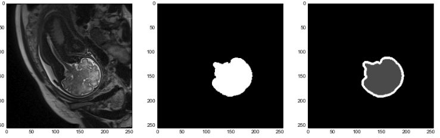
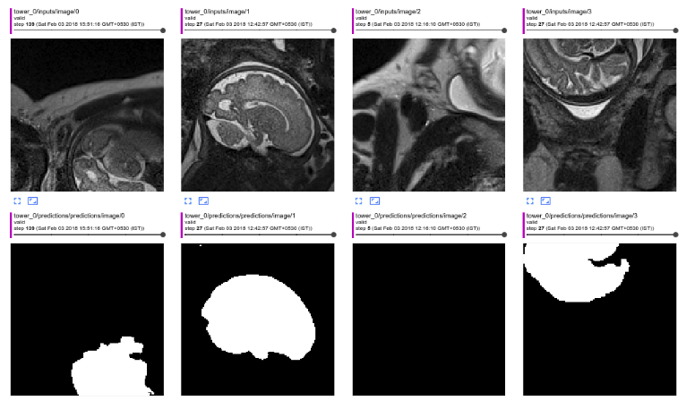
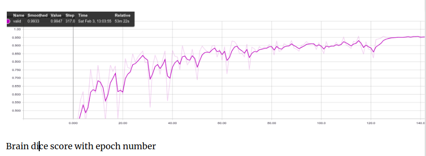

# Fetal-Brain-Segmentation

## Introduction

This repository contains the implementation of 2D UNet architecture for fetal brain segmentation

## Network Architecture


(https://arxiv.org/pdf/1505.04597.pdf)

## Raw data



First figure shows raw MR image, second hand annotated groundtruth image and last shows weight map for spatial weighted cross entropy loss  
<hr>

## Results

### Model predictions




### Dice score with epochs



<hr>

## How to use?

~~~~

git clone https://github.com/koriavinash1/Fetal-Brain-Segmentation.git
cd Fetal-Brain-Segmentation
pip install -r requirements.txt

~~~~

<hr>

## Pre-Processing data

Run Generate_Procesed_Data notebook for generating pre-processed data


## Folder structure

> ./src consists all source codes


> > config -> all initial configurations

> > data_loader -> multithread data loader

> > estimator -> model estimator class

> > network -> network architecture definition

> > runner -> main function


``` python runner.py``` for training  and ```python predictor.py``` for testing the model 

<hr>

If any comments or issues, pull requests/issues are Welcomed....

Thankyou


### Contact 

* Avinash Kori (avinashgkori@smail.iitm.ac.in)

